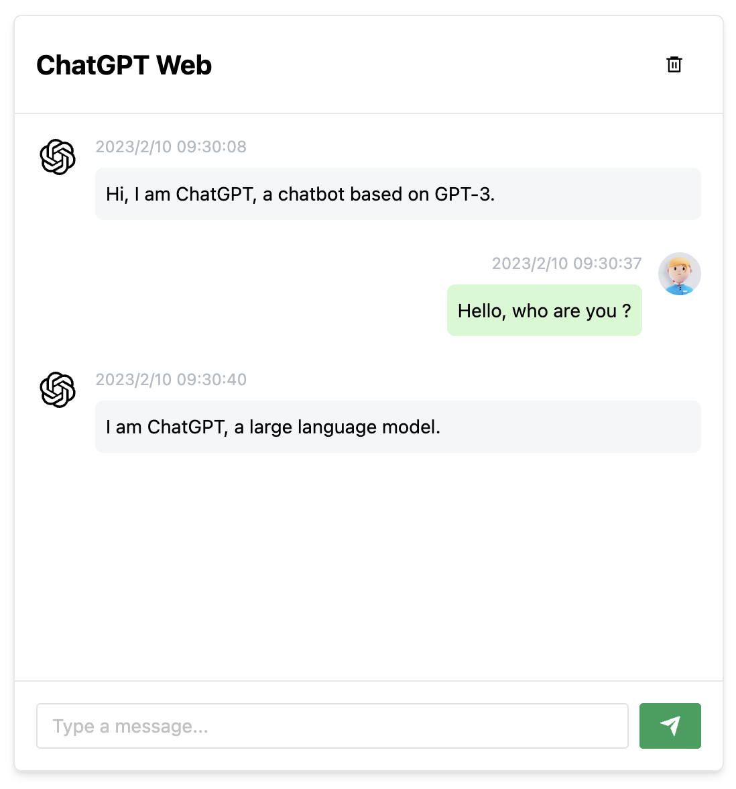

# 来自[Chanzhaoyu的chatgpt-web](https://github.com/Chanzhaoyu/chatgpt-web)
# 版本 1.0.4 的 Release: [v1.0.4](https://github.com/Chanzhaoyu/chatgpt-web/releases/tag/v1.0.4)

[English](./README.md) | 中文

使用 express 和 vue3 搭建的 ChartGPT 演示网页



## 使用
> Make sure `node >= 18`

如果你没有安装过 `pnpm`
```shell
npm install pnpm -g
```

安装依赖
```shell
pnpm install
```

获取 [OpenAI API key](https://platform.openai.com/overview) 到本地环境变量

```
# .env
OPENAI_API_KEY="Your Key"
```

运行服务
```shell
pnpm run service
```

运行网页
```shell
pnpm run dev
```

## License
MIT © [ChenZhaoYu](./license)
